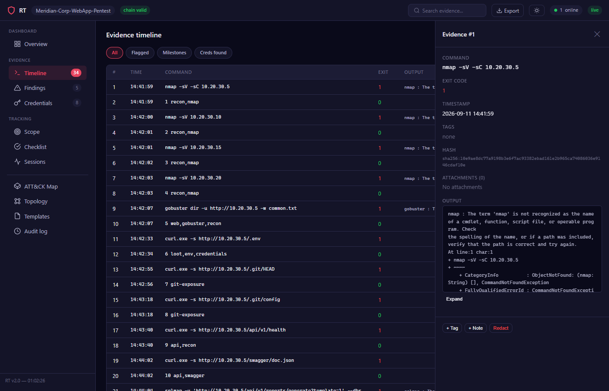
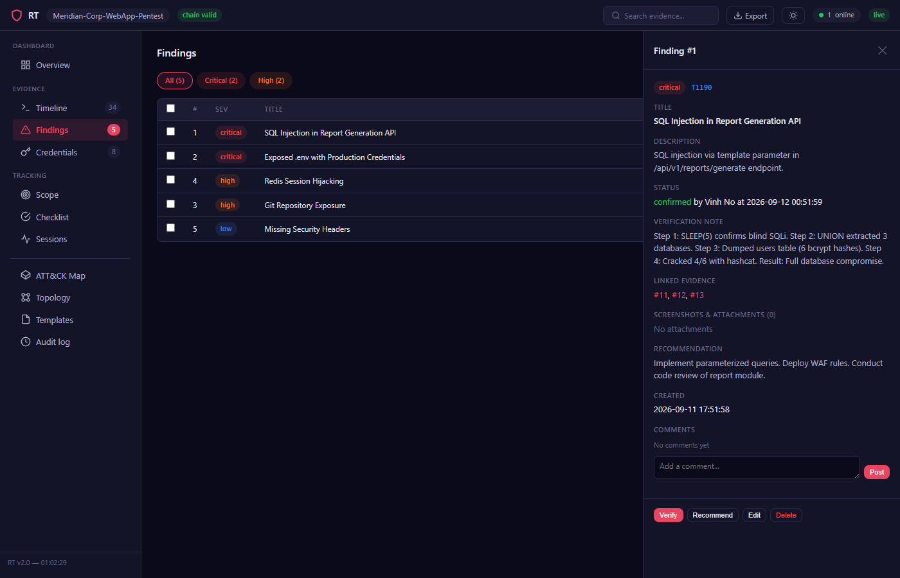
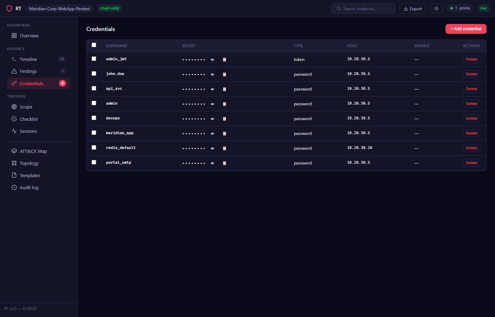
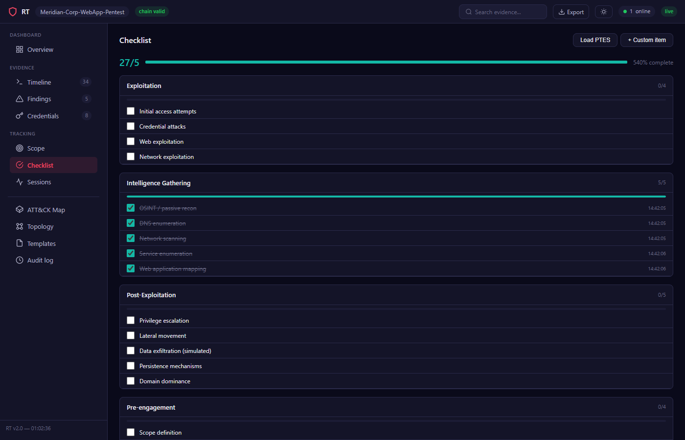
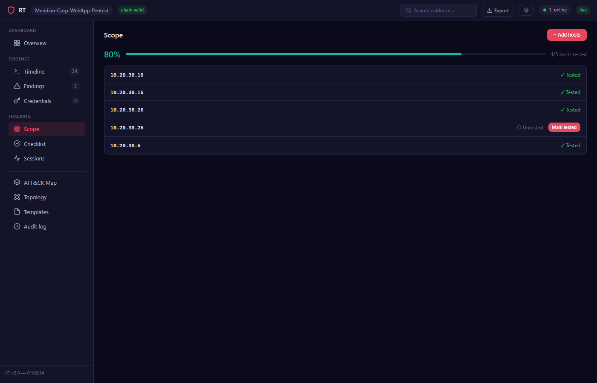
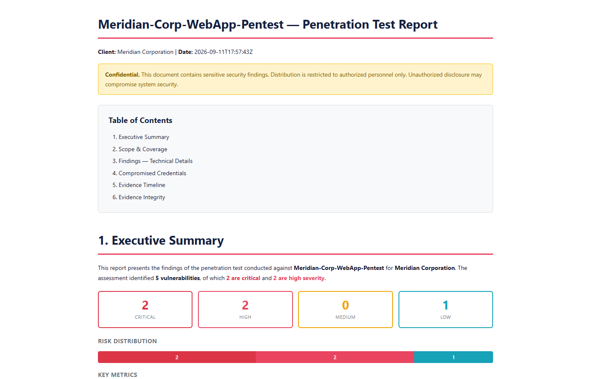

# RT — Red Team Evidence Logger

**Hack more, document less.** RT is a single-binary CLI tool that auto-captures evidence during red team engagements, manages findings, and generates professional pentest reports.

## Quick Start — AI Agent Mode

The recommended way to use RT: a central server + Claude Code agent. You set up the server and workspace once, then just give the agent a target — it knows exactly what to do.

### 1. Start the server

```bash
go build -o rt ./cmd/rt/
rt new "ACME-2026" --client "Acme Corp"
rt unlock
rt serve --listen 0.0.0.0:8443
```

The server prints a setup token on first start — use it to create your lead account in the dashboard.

### 2. Create an operator + generate workspace

```bash
rt operator-add agent-1 operator
# → API Key: rt_key_a8Kd9m...

rt init-workspace
# → generates CLAUDE.md + pentest skills (.claude/commands/) in your workspace
```

`rt init-workspace` creates agent instructions with 7 finding categories, finding lifecycle, scope management, credential handling, and collaboration procedures. This is the "brain" — the agent reads CLAUDE.md and knows how to use every RT command without being told.

### 3. Open Claude Code and prompt

```bash
claude
```

Then just tell the agent:

```
connect to https://10.10.10.100:8443 with key rt_key_a8Kd9m..., target is 10.10.10.1
```

The agent will:
- `rt join` to the server (credentials saved for next time — future sessions just need `rt join`)
- Run recon, enumerate services, attempt exploits via `rt exec`
- Auto-create findings, log credentials, track scope
- All evidence auto-synced to the dashboard in real-time

If the server goes unreachable, evidence is queued locally at `~/.rt/.sync-queue.json` and auto-drained on reconnect.

### Available agent skills

After `rt init-workspace`, these slash commands are available in Claude Code:

| Skill | Description |
|-------|-------------|
| `/recon` | Network reconnaissance — scan, import, mark scope |
| `/exploit` | Exploitation — capture exploit, create finding, store creds |
| `/post-exploit` | Post-exploitation — privesc, lateral movement, persistence |
| `/report` | Generate engagement report + exports |
| `/standup` | Daily progress summary |

## Quick Start — CLI Mode

For manual use without a central server.

### Create an engagement

```bash
rt new "ACME-2026" --client "Acme Corp"
rt unlock
```

### Capture evidence

```bash
rt start                    # start interactive session
# hack normally — everything is recorded
rt stop                     # stop session + encrypt db

# or capture single commands
rt exec nmap -sV 10.10.10.1
```

### Manage findings

```bash
rt finding "SQLi in /login" --priority critical --mitre T1190
rt finding-note 1 "Step 1: POST /login with payload ' OR 1=1--. Step 2: Server returned 200 with admin session. Result: Full authentication bypass."
rt verify-finding 1 confirmed --screenshot proof.png
rt recommend 1 "Use parameterized queries"
rt findings                 # list all findings
```

### Scope & checklist

```bash
rt scope 10.10.10.1,10.10.10.2,10.10.10.3
rt scope-tested 10.10.10.1
rt scope-untested
rt checklist-load ptes
rt check 1
rt standup                  # daily progress summary
```

### Generate reports

```bash
rt report --html -o report.html
rt report -o report.md              # markdown
rt report --exec -o exec.html       # executive summary only
rt report --tech -o tech.html       # technical details only
```

### Export

```bash
rt export ghostwriter -o findings.json
rt export csv -o findings.csv
rt export mitre -o navigator.json   # ATT&CK Navigator layer
rt export json -o full.json
```

### Import external tool output

```bash
rt import nmap-results.xml
rt import nuclei-output.json
rt import ports.csv
```

### Web dashboard

```bash
rt serve --listen localhost:8080
# opens dashboard with live evidence feed, findings, timeline
```

## Architecture

```
┌─────────────┐
│   CLI (rt)   │  spf13/cobra
└──────┬───────┘
       │
┌──────┴───────┐
│  20 packages  │  internal/
│  single binary│
└──────┬───────┘
       │
┌──────┴───────┐
│   SQLite DB   │  modernc.org/sqlite (pure Go, no CGO)
│  AES-256-GCM  │  file-level encryption
└───────────────┘
```

**Key design decisions:**

- **Pure Go SQLite** (`modernc.org/sqlite`) — no CGO, no MinGW, single binary cross-compilation
- **File-level encryption** — `.db.enc` ↔ `.db` instead of SQLCipher, avoids CGO dependency
- **Evidence hash chain** — SHA-256 chain per session, tamper-evident audit trail
- **Double-encrypted credentials** — AES-256-GCM inside the already-encrypted database
- **Raw WebSocket** — HTTP hijack implementation, no gorilla/websocket dependency
- **Embedded SPA** — vanilla JS dashboard with D3.js visualizations, no npm/build step

## Project Structure

```
cmd/rt/             CLI commands (one file per command group)
internal/
  agentctx/         auto-generated CLAUDE.md + skills for AI agents
  attachments/      file BLOB storage
  audit/            immutable audit log
  capture/          command execution + evidence recording
  checklist/        PTES/custom checklist management
  config/           RT home directory management
  credentials/      credential locker + auto-parser
  crypto/           Argon2id + AES-256-GCM + hash chain
  db/               SQLite operations + encryption lifecycle
  engagement/       engagement CRUD
  evidence/         evidence bus + hash chain + auto-flag
  export/           ghostwriter, csv, json, mitre exports
  findings/         finding management + verify + merge
  importer/         nmap XML, nuclei JSON, CSV, text import
  operator/         RBAC + API key management
  report/           HTML + Markdown report generation
  rules/            auto-flag rules engine (YAML regex matching)
  remote/           HTTP client for central server API
  scope/            scope host tracking
  search/           evidence text search + read-only SQL
  server/           web dashboard + central server API + WebSocket
  session/          session management
```

## Commands

| Command | Description |
|---------|-------------|
| `rt new` | Create new engagement |
| `rt ls` | List engagements |
| `rt use` | Switch active engagement |
| `rt unlock` / `rt lock` | Decrypt/encrypt database |
| `rt start` / `rt stop` | Start/stop capture session |
| `rt exec` | Capture a single command |
| `rt join` / `rt leave` | Join/leave remote server (auto-sync mode) |
| `rt sync` | Fetch engagement context from remote server |
| `rt tag` / `rt note` / `rt milestone` / `rt bookmark` | Annotate evidence |
| `rt timeline` | Show evidence timeline |
| `rt finding` / `rt findings` | Create/list findings |
| `rt finding-note` | Set PoC notes for a finding |
| `rt verify-finding` | Verify finding (confirmed/false-positive) |
| `rt merge-findings` | Merge duplicate findings |
| `rt recommend` | Add recommendation to finding |
| `rt cred` / `rt creds` | Store/list credentials |
| `rt screenshot` | Capture screenshot evidence |
| `rt attach` / `rt attachments` | Attach files to evidence |
| `rt delete` / `rt redact` | Soft-delete/redact evidence |
| `rt report` | Generate HTML/Markdown report |
| `rt export` | Export (ghostwriter/csv/json/mitre) |
| `rt serve` | Start web dashboard + central server |
| `rt operator-add` / `rt operator-list` | Manage RBAC operators |
| `rt remote-exec` | Execute command + submit evidence (legacy) |
| `rt remote-session` | Start/stop remote session (legacy) |
| `rt scope` / `rt scope-list` / `rt scope-tested` / `rt scope-untested` | Scope management |
| `rt checklist` / `rt checklist-load` / `rt check` / `rt uncheck` | Checklist tracking |
| `rt search` | Search evidence by text |
| `rt query` | Read-only SQL query |
| `rt import` | Import nmap/nuclei/CSV |
| `rt standup` | Daily progress summary |
| `rt time` | Session time overview |
| `rt verify-chain` | Verify evidence hash chain integrity |
| `rt audit` | View audit log |
| `rt status` | Show engagement status |
| `rt init-workspace` | Generate agent CLAUDE.md + skills |
| `rt wipe` | Permanently delete engagement |

## Security

- Database encrypted at rest with AES-256-GCM (Argon2id KDF: 512MB memory, 4 iterations)
- Evidence hash chain provides tamper detection
- Credentials double-encrypted within the database
- Web dashboard: auto TLS (ECDSA P-256), CSP headers, per-IP rate limiting (60 req/min)
- API keys: SHA-256 hashed storage, 192-bit entropy
- Central server REST API: RBAC-protected POST /api/evidence, /api/sessions, /api/creds
- Remote agents: persistent config at `~/.rt/server.json` (or env var RT_SERVER/RT_API_KEY), --insecure for self-signed certs
- ANSI escape code stripping at capture, API, and display layers (defense-in-depth)
- Read-only SQL query mode with keyword safety guards

## Features

- **Automatic evidence capture** — every command + output recorded with SHA-256 hash chain integrity
- **AES-256-GCM encryption** — database encrypted at rest with Argon2id KDF
- **Auto-flag engine** — 12 built-in rules detect credentials, admin access, ADCS, kerberoast, etc.
- **Auto-cred parser** — extracts credentials from secretsdump/mimikatz/kerberoast output
- **Finding management** — create, verify, merge findings with MITRE ATT&CK mapping + PoC notes
- **Report generation** — professional HTML pentest reports with executive summary, risk distribution, and technical details
- **Export formats** — Ghostwriter JSON, CSV, MITRE ATT&CK Navigator layer, full JSON
- **Web dashboard** — real-time SPA with WebSocket live feed, MITRE ATT&CK map, network topology
- **RBAC** — 4 roles (lead/operator/reviewer/viewer) with API key auth
- **Setup token** — auto-generated token printed on server start for instant lead access
- **Per-page docs** — built-in documentation modal on every dashboard page
- **AI agent integration** — auto-generates CLAUDE.md + pentest skills per engagement
- **Tool import** — nmap XML, Nuclei JSON, CSV, raw text
- **Scope tracking** — host management with tested/untested status
- **PTES checklist** — 27-item template with check-off tracking
- **Remote-only mode** — `rt join` + `rt exec` auto-syncs to server, no local engagement needed
- **Persistent server config** — server credentials remembered after first `rt join`, reconnect with just `rt join`
- **Offline evidence queue** — evidence queued locally when server unreachable, auto-drained on reconnect
- **ANSI stripping** — clean evidence output from colored terminal tools (evil-winrm, crackmapexec, etc.)
- **Resizable detail panel** — drag to resize evidence output, copy-to-clipboard, fullscreen toggle
- **Enterprise central server** — remote agents POST evidence via REST API

## Dashboard

### Evidence Timeline
34 evidence entries with auto-flagging, credential detection, and MITRE tagging:



### Findings
All findings verified and confirmed with severity badges and MITRE ATT&CK mappings:



### Credentials
Extracted credentials with masked secrets and reveal/copy actions:



### PTES Checklist
Track assessment progress with the built-in 27-item PTES checklist:



### Scope Coverage
Track which hosts have been tested:



### Report
Professional HTML pentest report with executive summary, risk distribution, findings with PoC notes, and evidence timeline:



## Requirements

- Go 1.21+
- No CGO required (pure Go SQLite)
- Windows, Linux, macOS

## License

Private — internal red team tooling.
